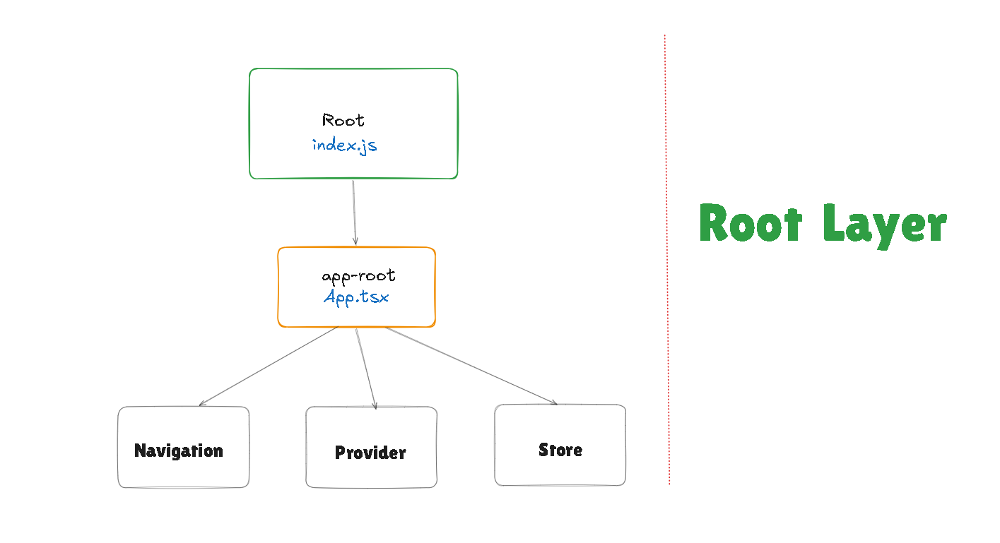
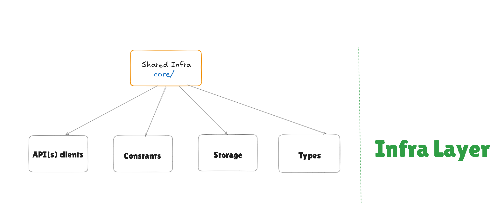
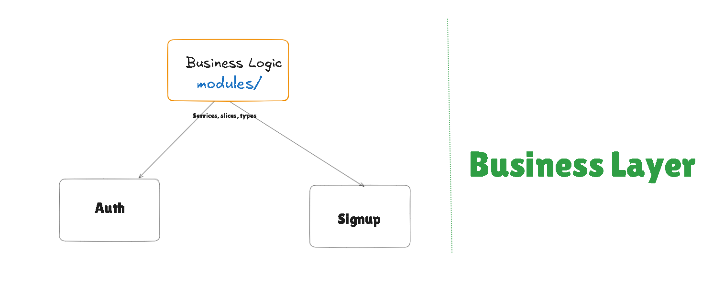
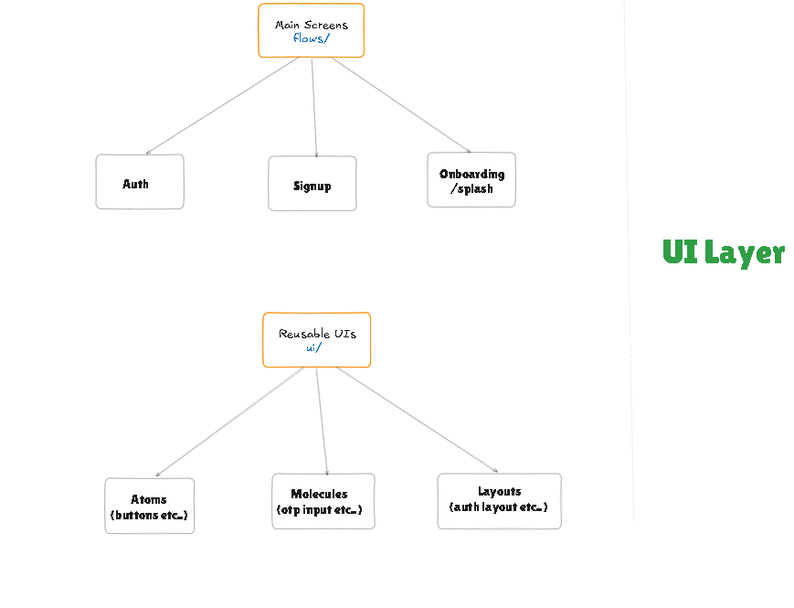

# FarmerEats

React Native 0.84 (New Architecture) mobile app for farmer onboarding, authentication, and business registration.

[Download The App (APK)](https://drive.google.com/drive/folders/1Uh4ZDEZ1jb6XSTujoyJsdJGx8T3XAczf?usp=sharing)


## DEMO (click to watch the demo)

[](https://www.youtube.com/watch?v=vsuzuTOAN4s)

## Installation

```bash
git clone git@github.com:iCoderabhishek/FarmerEats.git
cd FarmerEats
git checkout dev
npm install
```

Create `.env` in project root:
 
```
API_BASE_URL=https://sowlab.com/assignment
```

Run:

```bash
npm run android
```

Release APK:

```bash
cd android && ./gradlew assembleRelease
```

Output: `android/app/build/outputs/apk/release/app-release.apk`


## Folder Structure Diagram









## Folder Structure


```
src/
  app/
    navigation/           # Root, Auth, Signup navigators
    providers/            # Redux + Navigation providers
    store.ts              # Redux store config
  core/
    api/                  # Axios client with interceptors
    constants/            # Config, endpoints, theme, US states
    storage/              # AsyncStorage token persistence
    utils/                # Zod validation schemas
    types/                # Shared TypeScript types
  flows/
    splash-flow/          # Onboarding carousel
    auth-flow/            # Login, forgot password, OTP, reset
    signup-flow/          # 4-step signup + success screen
    home-flow/            # Post-auth home screen
  modules/
    auth/                 # Auth slice + login/logout/reset services
    signup/               # Signup slice + register service
  ui/
    atoms/                # Text, Button, Input
    molecules/            # Toast, OTP input, Social buttons, State picker
    layouts/              # ScreenWrapper, AuthLayout
  assets/                 # SVG icons, images, fonts
```

## Tech Stack

| Library | Purpose |
|---|---|
| React Native 0.84 | UI framework, New Architecture enabled |
| Redux Toolkit | State management |
| React Navigation 7 | Native stack navigation |
| Axios | HTTP client with interceptors |
| Zod 4 | Runtime form validation |
| AsyncStorage | Token persistence |
| react-native-config | Environment variables |
| react-native-document-picker | File selection (patched for RN 0.84) |
| react-native-svg | SVG icon rendering |

## Redux Usage

Two slices in `src/app/store.ts`:

**auth** (`modules/auth/auth.slice.ts`): Holds `isAuthenticated`, `user`, `token`, `loading`, `error`. Drives conditional navigation in `RootNavigator` -- when `isAuthenticated` is true, the navigator renders authenticated screens; otherwise, splash/auth/signup flows.

**signup** (`modules/signup/signup.slice.ts`): Accumulates form data across 4 signup steps. Each step validates locally with Zod, dispatches its portion to the slice, then navigates forward. Step 4 reads the entire slice and posts to the register API.

Services (`auth.service.ts`, `signup.service.ts`) are thunks that call APIs and dispatch slice actions. Screens never call APIs directly.

## API Layer

Single Axios instance in `core/api/api-client.ts` with two interceptors:

**Request**: Reads JWT from AsyncStorage, attaches `Authorization: Bearer <token>` to every request.

**Response**: Backend returns HTTP 200 for everything. Success/failure is determined by `response.data.success`. If not true, a global error toast is shown and the promise is rejected. Screens never handle HTTP errors directly.

Endpoints in `core/constants/endpoints.ts`:

```
POST /user/register        # Signup
POST /user/login           # Login
POST /user/verify-otp      # OTP verification
POST /user/reset-password  # Password reset
```

Token lifecycle: saved on login/register, restored on app launch (bootstrap in `RootNavigator`), cleared on logout.

## Is this Codebase Scalable??

**Flow-based structure**: Each feature is a self-contained directory under `flows/`. Adding a feature means adding a new flow and registering its navigator. Existing code is untouched.

**Module pattern**: Business logic lives in `modules/` with co-located slice + service + types per domain. A new domain (e.g., `orders`) gets its own module and slice added to the store.

**Atomic UI**: Components layered as atoms, molecules, layouts. Screens compose from existing primitives without duplicating styles.

**Centralized theme**: All colors, fonts, spacing in `theme.ts`. No inline hardcoded values. Design system changes are a single-file update.

**Centralized API**: New endpoint = one line in `endpoints.ts` + one service function. Auth, error handling, toasts are automatic via interceptors.

**Validation**: All schemas in `schemas.ts`. New form = new Zod schema + `safeParse` call.
